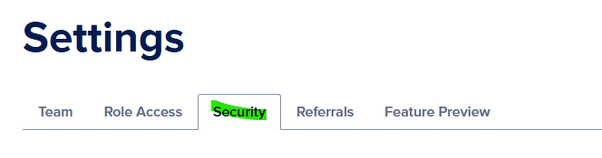
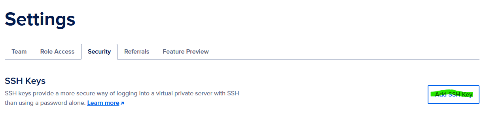

# How to Add an SSH Key to Your DigitalOcean Project

This guide walks you through creating an SSH key pair and adding it to your DigitalOcean account for secure droplet access.

## Prerequisites

- Command line access (Terminal on Mac/Linux, PowerShell/Git Bash on Windows)
- A DigitalOcean account

## Step 1: Generate an SSH Key Pair

SSH keys provide a secure way to authenticate with your DigitalOcean droplets without using passwords.

### Windows

**Using PowerShell or Git Bash:**

```bash
# Set your identifier (e.g., DNS zone, project name, environment)
azure_dns_zone="us.rentals"
your_email="rfellows@bogus.email.com"

# Generate the SSH key pair with a custom filename
ssh-keygen -t rsa -b 4096 -C "your_email@example.com" -f ~/.ssh/id_rsa_${azure_dns_zone}

# This creates:
# - Private key: ~/.ssh/id_rsa_us.rentals
# - Public key: ~/.ssh/id_rsa_us.rentals.pub

# When prompted:
# - Enter passphrase (recommended for security, or press Enter for no passphrase)
# - Enter same passphrase again

# Display the public key
cat ~/.ssh/id_rsa_${azure_dns_zone}.pub

# Copy the entire output - this is your SSH public key
```

**Alternative: Using default filename:**

```bash
# Generate with default filename (id_rsa)
ssh-keygen -t rsa -b 4096 -C "your_email@example.com"

# When prompted, press Enter to accept default location or specify custom path
# Display the public key
cat ~/.ssh/id_rsa.pub
```

**Using Windows Command Prompt:**

```cmd
REM Set your identifier
set azure_dns_zone=us.rentals

REM Generate the SSH key pair with a custom filename
ssh-keygen -t rsa -b 4096 -C "your_email@example.com" -f %USERPROFILE%\.ssh\id_rsa_%azure_dns_zone%

REM Display the public key
type %USERPROFILE%\.ssh\id_rsa_%azure_dns_zone%.pub
```

### Mac

```bash
# Set your identifier (e.g., DNS zone, project name, environment)
azure_dns_zone="us.rentals"

# Generate the SSH key pair with a custom filename
ssh-keygen -t rsa -b 4096 -C "your_email@example.com" -f ~/.ssh/id_rsa_${azure_dns_zone}

# This creates:
# - Private key: ~/.ssh/id_rsa_us.rentals
# - Public key: ~/.ssh/id_rsa_us.rentals.pub

# When prompted:
# - Enter passphrase (recommended for security, or press Enter for no passphrase)
# - Enter same passphrase again

# Display the public key
cat ~/.ssh/id_rsa_${azure_dns_zone}.pub

# Copy the entire output - this is your SSH public key
```

### Linux

```bash
# Set your identifier (e.g., DNS zone, project name, environment)
azure_dns_zone="us.rentals"

# Generate the SSH key pair with a custom filename
ssh-keygen -t rsa -b 4096 -C "your_email@example.com" -f ~/.ssh/id_rsa_${azure_dns_zone}

# This creates:
# - Private key: ~/.ssh/id_rsa_us.rentals
# - Public key: ~/.ssh/id_rsa_us.rentals.pub

# When prompted:
# - Enter passphrase (recommended for security, or press Enter for no passphrase)
# - Enter same passphrase again

# Display the public key
cat ~/.ssh/id_rsa_${azure_dns_zone}.pub

# Copy the entire output - this is your SSH public key
```

> **Note:**
> - The `-t rsa` flag specifies the RSA algorithm
> - `-b 4096` sets the key size to 4096 bits for enhanced security
> - `-C` adds a comment (typically your email) to help identify the key
> - `-f` specifies the output filename (using the variable to create unique key names per project/environment)

## Step 2: Add the SSH Key to DigitalOcean

1. **Navigate to the Security Settings**
   - Go to [https://cloud.digitalocean.com/account/security](https://cloud.digitalocean.com/account/security)
   - Or from the DigitalOcean dashboard: Click your profile → Settings → Security tab

   

2. **Add Your SSH Key**
   - Click the **"Add SSH Key"** button

   

3. **Paste Your Public Key**
   - Paste the entire contents of your public key (from `cat ~/.ssh/id_rsa.pub`) into the "SSH key content" field
   - Give your key a memorable name (ideally , based on the domain name of the project for example: us.rentals, top.properties, dot.properties)
    - (**note** : it is important to maintain consistency so that the devops pipelines can follow the azure DNS entries we are hosting )
   - Click **"Add SSH Key"**

## Step 3: Using Your SSH Key

When creating a new droplet, select your SSH key from the "Authentication" section. This will automatically configure the droplet to accept your SSH key for authentication.

### Connecting to Your Droplet

**If you used a custom key name:**

```bash
# Set the same variable as before
azure_dns_zone="us.rentals"

# Connect using the custom key
ssh -i ~/.ssh/id_rsa_${azure_dns_zone} root@your_droplet_ip
```

**If you used the default key name:**

```bash
# Connect using default key (automatically detected)
ssh root@your_droplet_ip
```

**To avoid typing the key path every time, add it to your SSH config:**

```bash
# Edit or create SSH config file
nano ~/.ssh/config

# Add this configuration (replace values as needed):
Host us-rentals-droplet
    HostName your_droplet_ip
    User root
    IdentityFile ~/.ssh/id_rsa_us.rentals
    IdentitiesOnly yes

# Save and exit (Ctrl+X, then Y, then Enter)

# Now you can connect simply with:
ssh us-rentals-droplet
```

## Security Best Practices

- **Use a passphrase** - Adds an extra layer of security to your private key
- **Never share your private key** - Only share the public key (`.pub` file)
- **Use different keys for different purposes** - Consider separate keys for work and personal projects
- **Regularly rotate keys** - Update your SSH keys periodically
- **Keep your private key secure** - Store it only on trusted devices

## Troubleshooting

**Permission denied (publickey)**
- Ensure your key was added to DigitalOcean correctly
- Verify the key is in your `~/.ssh/` directory
- Check file permissions: `chmod 600 ~/.ssh/id_rsa`

**Key not found**
- Make sure you're using the correct path to your private key
- Try specifying the key explicitly: `ssh -i ~/.ssh/id_rsa root@your_droplet_ip`

## Additional Resources

- [DigitalOcean SSH Keys Documentation](https://docs.digitalocean.com/products/droplets/how-to/add-ssh-keys/)
- [GitHub SSH Key Guide](https://docs.github.com/en/authentication/connecting-to-github-with-ssh)
